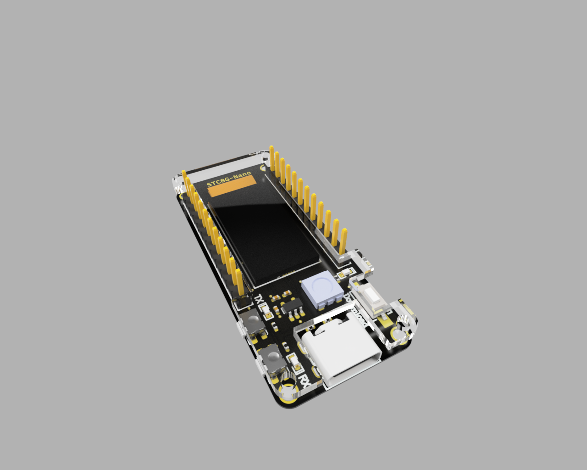

# STC8G-Nano
设计初衷是为了方便自己调试项目用，板子外形仿照了稚晖君的ESP32-PicoDK进行设计。

> 采用增强型51，比传统52快12倍：
>
> * 采用STC8G1K17芯片，功能非常强大
> * 集成了一个0.78寸的OLED
> * 自带5050幻彩灯 RGB灯
> * 两路UART
> * ............

市面上的51最小系统居然TYPE-C都没有，所以板子上直接用TYPE-C

**板子设计已打样验证无误，好用记得点星星**👇

