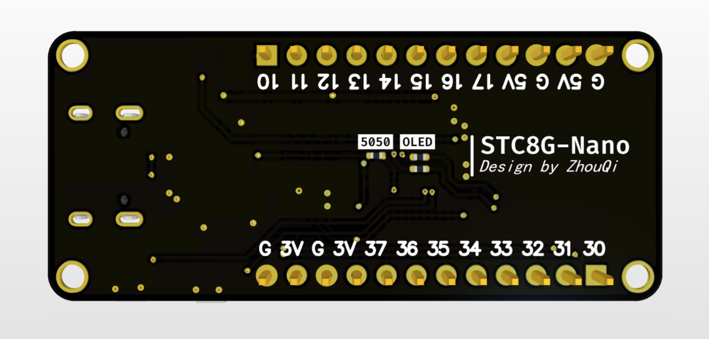
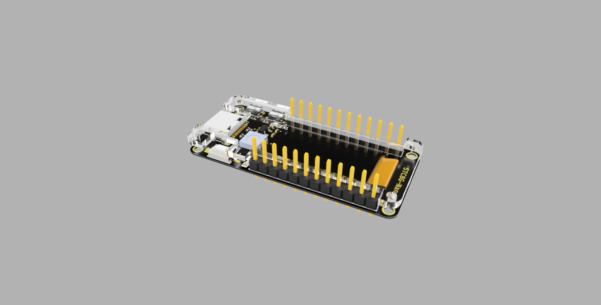

# STC8G-Nano
硬件在稍作改动，稍后上传。

设计初衷是为了方便自己调试项目用，板子外形仿照了稚晖君的ESP32-PicoDK进行设计。

> 采用增强型51，比传统52快12倍：
>
> * 采用STC8G1K17芯片，功能非常强大
> * 集成了一个0.78寸的OLED
> * 自带5050幻彩灯 RGB灯
> * 两路UART
> * ............

市面上的51最小系统居然TYPE-C都没有，所以板子上直接用TYPE-C

**板子设计已打样验证无误，好用记得点星星**👇

##  特性

* 引出P1口，P3口。
* 板载一个一个OLED、一个白色LED、一个USB转串口、一个幻彩5050灯（RGB）、两个中断按键
* 上面提到的外设都是可以在板子背面通过**跳线**选择连接GPIO或者断开的，所以不影响GPIO作其他用途
* 极致迷你尺寸
* 带配套亚克力外壳（设计中稍后更新）

